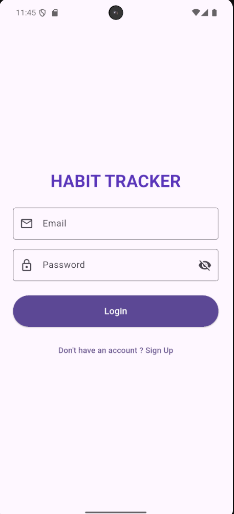
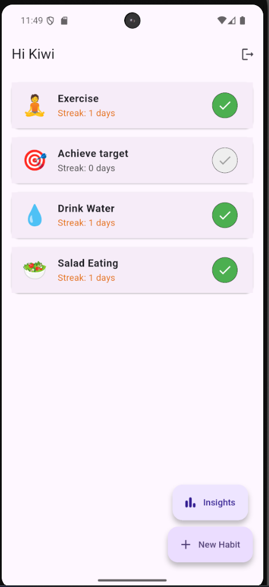
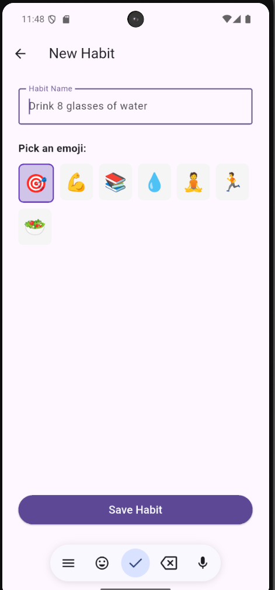
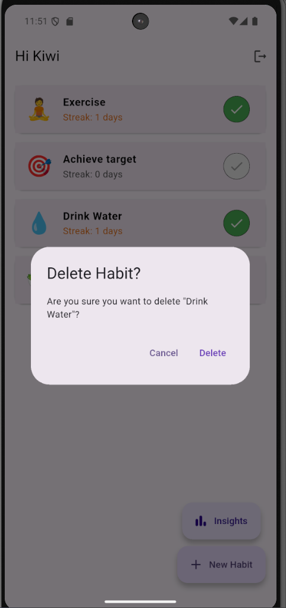
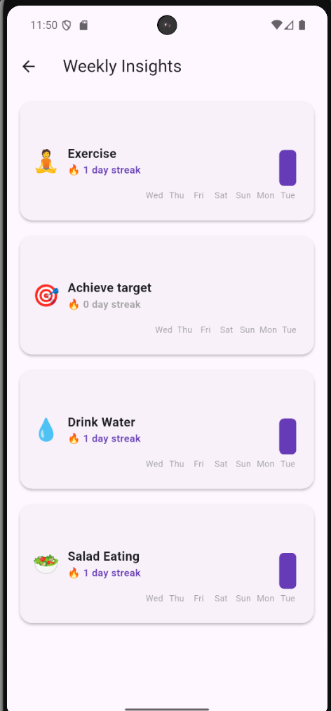

# 📱 Habit Tracker

A clean, simple, and basic Flutter app for tracking habits, building routines, and supporting self‑improvement.

---

## 📸 Screenshots

# Login Screen


# Home Screen


# Add Habit Screen


# Delete Habit


# Weekly Insights


*(Add more screenshots to the `screenshots/` folder and reference them here.)*

---

## ✨ Features

- Create, edit, and delete habits
- Mark habits as complete for each day
- View streaks and progress
- Persist habits across app restarts with local storage (Hive)
- Simple and intuitive UI

---

## 🚀 Getting Started

First, ensure you have [Flutter installed](https://flutter.dev/docs/get-started/install).

### 1. Clone the repository
```sh
git clone https://github.com/Riddhi887/Habit_Tracker.git
cd Habit_Tracker
```

### 2. Install dependencies
```sh
flutter pub get
```

### 3. Run the app
```sh
flutter run
```

---

## 📂 App Structure

The main files and their purposes are:

- `lib/main.dart` → App entry point and root widget setup
- `lib/screens/` → All UI screens (e.g., HomeScreen, AddHabitScreen)
- `lib/models/` → Habit data model and data handling
- `lib/widgets/` → Custom reusable UI components
- `lib/utils/` → Utility functions/helpers
- `pubspec.yaml` → Dependency and asset configuration

---

## 📝 Example: Main Entry Point

```dart
import 'package:flutter/material.dart';
import 'screens/home_screen.dart';

void main() => runApp(const HabitTrackerApp());

class HabitTrackerApp extends StatelessWidget {
  const HabitTrackerApp({Key? key}) : super(key: key);

  @override
  Widget build(BuildContext context) {
    return MaterialApp(
      title: 'Habit Tracker',
      theme: ThemeData(
        primarySwatch: Colors.blue,
      ),
      home: HomeScreen(), // The home screen of the app
    );
  }
}
```

---

## 🎯 Usage

### Adding a New Habit
1. On the Home Screen, tap the `+` button  
2. Enter details like name, frequency, and reminder time  
3. Tap **Save** to add your habit  

```dart
ElevatedButton(
  onPressed: () {
    if (_formKey.currentState!.validate()) {
      _formKey.currentState!.save();
      Navigator.pop(context);
    }
  },
  child: Text('Save'),
)
```

### Marking a Habit as Complete
On the Home Screen, tap the checkbox next to a habit to mark it as complete for today. The streak count updates automatically.

```dart
Checkbox(
  value: habit.isCompleted,
  onChanged: (newValue) {
    setState(() {
      habit.isCompleted = newValue!;
    });
  },
)
```

---

## 🎨 Customization

- Change the theme → edit `ThemeData` in `lib/main.dart`
- Add notifications/reminders → use [flutter_local_notifications](https://pub.dev/packages/flutter_local_notifications)

---

## 🤝 Contributing

Pull requests are welcome!  
For major changes, please open an issue first to discuss what you’d like to change.

1. Fork the repo  
2. Create a feature branch (`git checkout -b feature/AmazingFeature`)  
3. Commit your changes  
4. Push to the branch  
5. Open a Pull Request  

---

## 📂 Screenshots Folder Setup

To make screenshots display correctly:
1. Create a `screenshots/` folder in your repo root  
2. Move your images (e.g., `SnapShot1.png`) into it  
3. Commit and push:
   ```sh
   git add screenshots/SnapShot1.png
   git commit -m "Add screenshot"
   git push
   ```
4. Reference them in README with:
   ```
   
   ```

---

💡 Now your README will show screenshots directly on GitHub!

Made By: Riddhi Bagal
Made with ❤️ using Flutter 
